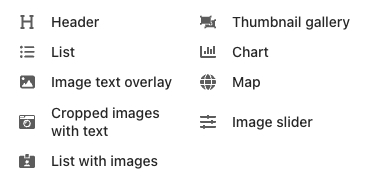

# wagtail_blocks 

[](https://pypi.python.org/pypi/wagtail-blocks)  [](https://wagtail-blocks.readthedocs.io/en/latest/?badge=latest) 

  

A Collection of awesome Wagtail CMS stream-field blocks and Charts.

*Check out [Awesome Wagtail](https://github.com/springload/awesome-wagtail) for more awesome packages and resources from the Wagtail community.*

## Quickstart

You must have your [Wagtail](https://wagtail.io/) project up and running:

```sh
pip install wagtail_blocks
```

Add the following enteries to your `settings.py` in the INSTALLED_APPS section:

```python
'wagtailfontawesomesvg',
'wagtail_blocks',
```

## Sample Usage

```python
from wagtail.fields import StreamField
from wagtail.admin.panels import FieldPanel

from wagtail_blocks.blocks import (
    HeaderBlock,
    ListBlock,
    ImageTextOverlayBlock,
    CroppedImagesWithTextBlock,
    ListWithImagesBlock,
    ThumbnailGalleryBlock,
    ChartBlock,
    MapBlock,
    ImageSliderBlock,
)

class HomePage(Page):
    body = StreamField([
        ('header', HeaderBlock()),
        ('list', ListBlock()),
        ('image_text_overlay', ImageTextOverlayBlock()),
        ('cropped_images_with_text', CroppedImagesWithTextBlock()),
        ('list_with_images', ListWithImagesBlock()),
        ('thumbnail_gallery', ThumbnailGalleryBlock()),
        ('chart', ChartBlock()),
        ('map', MapBlock()),
        ('image_slider', ImageSliderBlock()),
    ], blank=True, use_json_field=True)

    content_panels = Page.content_panels + [
        FieldPanel("body"),
    ]
```

### For HomePage template, blocks should be rendered with IDs to function properly

```html

    

```

## Available Blocks

Check Showcase for [Standard Blocks](docs/showcase/standard-blocks.md) or [Charts](docs/showcase/chart.md) or [Maps](docs/showcase/map.md)



- Header (H1, H2, H3, H4, H5, H6)
- List (Unordered List)
- Image with Text Overlay
- Cropped Images with Text
- List with Images and Links
- Thumbnail Gallery
- Image Slider
- Chart (Bar - Pie - Line - Area - Radar)
- Map (Marker with rich text description)

## Supported Versions

- Python 3.8 and higher
- Wagtail 4.1 and higher
- Bootstrap 4
