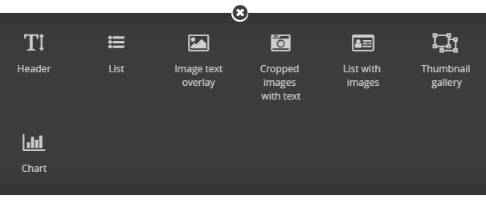

# Welcome to wagtail-blocks
A Collection of awesome Wagtail CMS stream-field blocks and Charts.

    

## Supported Versions
> - Python 2 & 3
> - All wagtail versions! (1.x | 2.x)
> - Bootstrap 4

  

## Available Blocks
Check Showcase for [Standard Blocks](https://wagtail-blocks.readthedocs.io/en/latest/showcase/standard-blocks/) 
or [Charts](https://wagtail-blocks.readthedocs.io/en/latest/showcase/chart/)
or [Maps](https://wagtail-blocks.readthedocs.io/en/latest/showcase/map/)

> - Header (H1, H2, H3, H4, H5, H6)
> - List (Unordered List)
> - Image with Text Overlay
> - Cropped Images with Text
> - List with Images and Links
> - Thumbnail Gallery
> - Image Slider
> - Chart (Bar - Pie - Line - Area - Radar)
> - Map (Marker with rich text description)