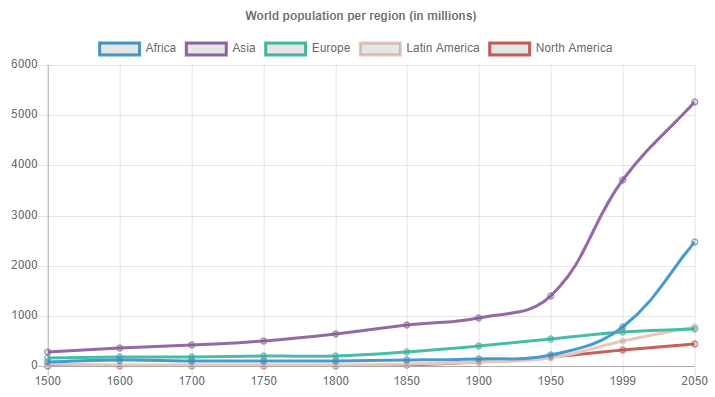
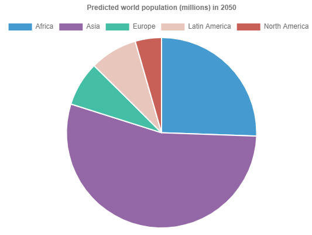
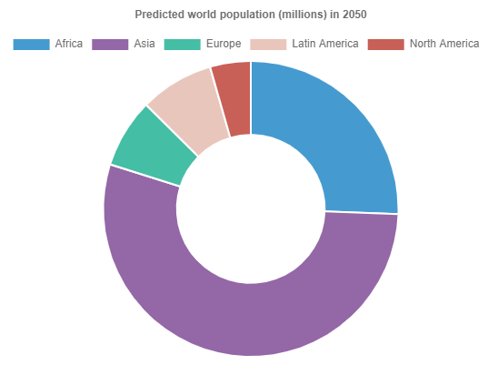
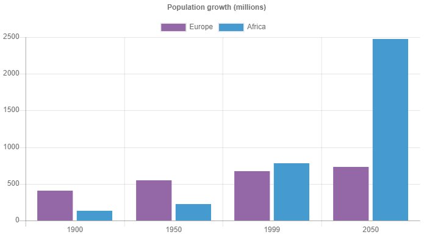

# All Charts support multiple datasets!

## Bar Chart

---

## Line Chart

---

## Pie Chart

---

## Radar Chart

---

## Polar Area Chart

---

## Doughnut Chart

---

## Horizontal Chart

---

## Multiple Datasets

support for all chart types not only bar!

---
