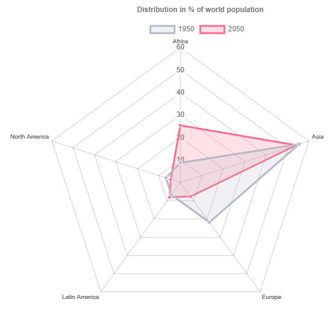
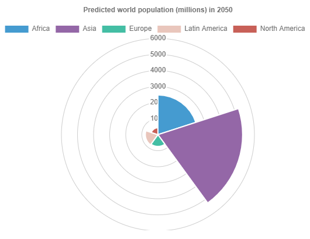

All Charts support multiple datasets!

### Bar Chart

---

### Line Chart

---

### Pie Chart

---

### Radar Chart

---

### Polar Area Chart

---

### Doughnut Chart

---

### Horizontal Chart

---

### Multiple Datasets
support for all chart types not only bar!

---
